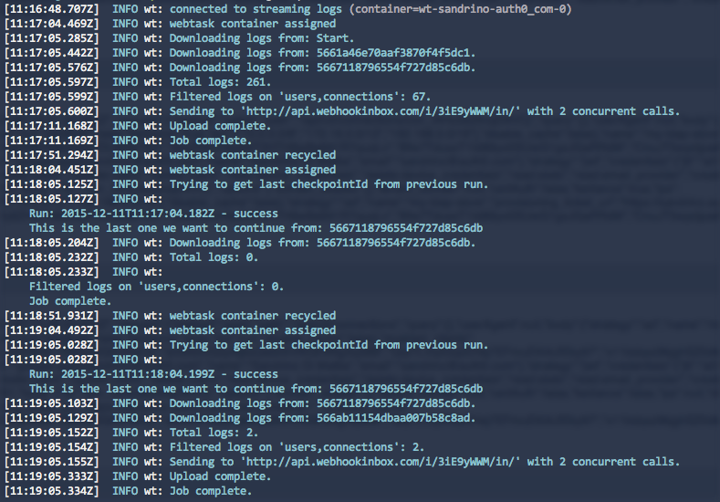

# Webhooks for Auth0's Management API with a Webtask

A webtask that allows you to define webhooks for Auth0's Management API. It will go through the audit logs and call a webhook for specific events. This can address use cases like:

> I want to call my own API each time a user is created or updated.

> I want to deprovision users from other systems whenever they are deleted in Auth0.

## Configure Webtask

If you haven't configured Webtask on your machine run this first:

```
npm i -g wt-cli
wt init
```

> Requires at least node 0.10.40 - if you're running multiple version of node make sure to load the right version, e.g. "nvm use 0.10.40"

## Deployment

If you just want to run it once:

```
wt create https://raw.githubusercontent.com/sandrinodimattia/auth0-api-hooks-webtask/master/task.js \
    --name auth0-api-hooks \
    --secret AUTH0_DOMAIN="YOUR_AUTH0_DOMAIN" \
    --secret AUTH0_GLOBAL_CLIENT_ID="YOUR_AUTH0_GLOBAL_CLIENT_ID" \
    --secret AUTH0_GLOBAL_CLIENT_SECRET="YOUR_AUTH0_GLOBAL_CLIENT_SECRET" \
    --secret AUTH0_API_ENDPOINTS="users,connections" \
    --secret WEBHOOK_URL="http://my.webhook.url/something" \
    --secret WEBHOOK_CONCURRENT_CALLS="10"
```

If you want to run it on a schedule (run every 5 minutes for example):

```
wt cron schedule \
    --name auth0-api-hooks \
    --secret AUTH0_DOMAIN="YOUR_AUTH0_DOMAIN" \
    --secret AUTH0_GLOBAL_CLIENT_ID="YOUR_AUTH0_GLOBAL_CLIENT_ID" \
    --secret AUTH0_GLOBAL_CLIENT_SECRET="YOUR_AUTH0_GLOBAL_CLIENT_SECRET" \
    --secret AUTH0_API_ENDPOINTS="users,connections" \
    --secret WEBHOOK_URL="http://my.webhook.url/something" \
    --secret WEBHOOK_CONCURRENT_CALLS="10" \
    --json \
    "*/5 * * * *" \
    https://raw.githubusercontent.com/sandrinodimattia/auth0-api-hooks-webtask/master/task.js
```

> You can get your Global Client Id/Secret here: https://auth0.com/docs/api/v1

The following settings are optional:

 - `AUTH0_API_ENDPOINTS`: This allows you to filter specific API endpoints, comma delimited (eg: I'm only interested in events happening on the `users` endpoint)
 - `WEBHOOK_CONCURRENT_CALLS`: Defaults to 5, these are the maximum concurrent calls that will be made to your web hook

## How it works

This webtask will process the Auth0 audit logs. Calls to the Management API (v2) are logged there and will be picked up by the webtask. These will then optionally be filtered (eg: only calls to the `users` endpoint) and will then be sent to your Webhook URL (POST).

Note that, if the URL we are sending the events to is offline or is returning anything that is not 200 OK (eg: Internal Server Error) processing will stop and the batch of logs will be retried in the next run. This means 2 things:

 - Logs are sent at least once, so make sure your webhook is idempotent
 - Since we are concurrently sending events, you'll need to take into account that events for the same resource (eg. a user) might not arrive in the right order.

To test this you could easily setup an endpoint on `http://requestb.in/` and use that as a Webhook URL. This will allow you to see the Webtask in action:


## Troubleshooting

To troubleshoot you can use the `wt logs` command to see the output of your Webtask in real time:


